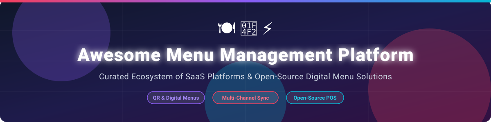

# 🍽️ Awesome-Menu-Management-Platform 📲

  

  
  
  
  
  
  

## 📌 Top Menu Management Platforms Ecosystem

**Curated List of SaaS Products & Open-Source GitHub Projects for Restaurant Digital Menus & Multi-Channel Menu Publishing** 🚀

*Focused on Digital Menus, Online Ordering Menus, Menu Sync Across Channels (DoorDash, Uber Eats, Grubhub), QR Code Menus & Restaurant POS Integration* 📋⚡

**Last updated: September 2026** 📅

---

This repository tracks notable **SaaS platforms** 🏢 and **open-source projects** 💻 for **Menu Management**. These solutions assist restaurant operators, digital managers, and hospitality technologists in creating, updating, and publishing digital menus across custom websites, QR code standees, online ordering systems, third-party delivery aggregators, and in-venue digital signage—featuring centralized catalog control and channel synchronization. 💡

---

## 📊 Market Overview & Industry Structure

> **📈 Estimated Market Size:** The global restaurant menu management and online ordering software market is estimated at **$3.8 Billion - $4.5 Billion (2026)** and is projected to expand at a CAGR of **14.2%** over the next decade.
> 
> **🧩 Market Concentration:** The sector is **moderately fragmented**. While delivery middleware giants (Deliverect, Otter) and unicorn ordering suites (Owner.com) dominate enterprise multi-location chain accounts, a wide long-tail of specialized platforms (Popmenu, MustHaveMenus, GloriaFood) and open-source stacks (URY) serve independent single-location restaurants and regional groups.

---

## 🏢 SaaS/Hosted Platforms

The table below summarizes commercial restaurant menu management, ordering platforms, and menu syndication tools, ordered by estimated company valuation/annual ARR (descending):

| 🏢 Platform | 💰 Valuation / ARR Tier | 💵 Specific Starting Pricing | 🎁 Free Tier / Free Trial Limits | 📝 Description |
| :--- | :--- | :--- | :--- | :--- |
| **[Owner.com](https://www.owner.com/)** 🚀 | **$2.3 Billion** Valuation (~$100M+ ARR) | Starts at **$299/month** (or commission cut on GMV) | **No free tier**; offers customized 14-day demo trial | Direct online ordering, AI marketing, & commission-free menu site platform for independent restaurants. |
| **[Deliverect Menu Sync](https://www.deliverect.com/)** ⚡ | **$1.4B–$1.9B** Valuation (€30M+ ARR) | Starts at **$69/month** (plus setup fee) | **14-day free trial** (up to 100 orders synced) | Enterprise menu aggregator syncing online menus with POS and channels (DoorDash, Uber Eats, Grubhub). |
| **[Otter Menu](https://www.tryotter.com/)** 🦦 | **~$1.0 Billion** Valuation (~$100M ARR) | Starts at **$79/month** per store location | **30-day free trial** (standard order aggregation features included) | Multi-channel menu management, kitchen display, and order aggregation suite for multi-location operators. |
| **[Popmenu](https://www.popmenu.com/)** 🍿 | **~$59.7 Million** Annual Revenue | Starts at **$269/month** (Starter Plan, $1/order online fee) | **No full free trial**; 20-min interactive demo + free waitlist tool trial | Interactive digital menus, dish-level reviews/photos, automated marketing, and commission-free ordering. |
| **[Allset Business](https://allset.com/)** 📍 | **~$22.9 Million** Annual Revenue | Commission-free tier / **12% - 15%** pickup fee options | **30-day commission-free trial** for new restaurant onboardings | Digital menu publishing and contactless pickup/table ordering platform for local diners. |
| **[SinglePlatform](https://www.singleplatform.com/)** 🌐 | **~$15.0 Million** Annual Revenue | Starts at **$109/month** (Fundamental Plan) | **7-day free trial** (menu sync preview across top search engines) | Menu syndication service publishing menus across Google, Tripadvisor, Yelp, and local web directories. |
| **[MenuDrive](https://www.menudrive.com/)** 🚗 | **~$12.0 Million** Annual Revenue | Starts at **$69/month** per store location | **30-day free trial** (full online menu setup testing included) | Custom-branded online menu and mobile ordering platform with built-in marketing automation. |
| **[MustHaveMenus](https://www.musthavemenus.com/)** 🎨 | **<$10.0 Million** Annual Revenue | Starts at **$49/month** (Pro Plan) | **7-day free trial** (access to menu templates & QR publishing editor) | Specialized menu graphic design, printable menu layout tool, and digital QR menu board publisher. |
| **[Menubly](https://www.menubly.com/)** 📲 | **<$5.0 Million** Annual Revenue | Starts at **$7.99/month** (billed annually) | **Free Forever Plan** (1 menu, up to 25 items); **30-day Pro trial** | Lightweight digital menu builder & QR-code generator for simple, responsive mobile restaurant menus. |
| **[GloriaFood](https://www.gloriafood.com/)** 🍕 *(Acquired by Oracle)* | **Acquired by Oracle** *(Shutting down April 2027)* | Core feature free; Paid add-ons from **$9/month** | **Free Forever Plan** (unlimited free orders; signups closed for shutdown) | Pioneer free online ordering engine & digital menu widget for independent restaurant websites. |

---

## 💻 Open-Source GitHub Projects

Below is a list of top open-source menu management repositories, self-hosted digital menu solutions, and POS connectors, sorted by GitHub stargazers count (descending):

-  **[URY – Open Source Restaurant Management](https://github.com/ury-erp/ury)** 🏪  
  FOSS restaurant management system built on ERPNext, featuring centralized menu management, recipes/BOM, outlet-level pricing and availability, and POS integration.

-  **[QR MENU (MERN Stack)](https://github.com/softenrj/qr-menu)** ⚛️  
  A modern MERN-stack (React, Node.js, Express, MongoDB) digital menu & ordering system replacing paper menus with dynamic QR-based alternatives and admin dashboards.

-  **[MenuQR (Next.js 14)](https://github.com/dustinwloring1988/menuqr/stargazers)** ⚡  
  Full-stack digital menu management built with Next.js 14, featuring real-time analytics, multi-language support, and customizable QR code generation.

-  **[No-Touch Digital Menu Template](https://github.com/blackgirlbytes/blackgyalbites)** 📄  
  Lightweight static HTML/CSS digital menu template designed for hosting on GitHub Pages without server maintenance.

-  **[QR Menu Laravel 12](https://github.com/yusuferdemyamali/qr-menu-laravel/stargazers)** 🐘  
  Digital menu system for cafes and restaurants using Laravel 12 and Filament admin panel for mobile-first contactless QR ordering.

-  **[Laracarte POS & Menu](https://github.com/aryadians/laracarte/stargazers)** 🛒  
  Restaurant management and POS system built with Laravel 12 & Livewire, including digital QR menus, Kitchen Display Systems (KDS), and inventory.

---

## 🤝 How to Contribute

1. Fork the repository 🍴
2. Add or update entries in `README.md` (following the established tabular/list structure) ✍️
3. Include factual data: name, official links, pricing, free trial limits, and exact descriptions 📝
4. Submit a Pull Request with a summary of changes 🚀

---

## ⚠️ Disclaimer

- This list is **community-curated** for educational purposes and market awareness — not an endorsement. ⚖️
- Operational menu and ordering systems handle sensitive customer data; open-source deployments require proper PCI-DSS compliance, security, and accurate allergen information.

---

## ☕ Support & Acknowledgments

Thank you for exploring and contributing to this ecosystem! If you find this curated list helpful, please consider starring ⭐ the repository, sharing it with fellow hospitality technologists, or contributing new tools.

---

## 📈 Star History

---

**Made with ❤️ for restaurant operators, digital managers, and hospitality technologists managing menus across channels.** 🍽️
